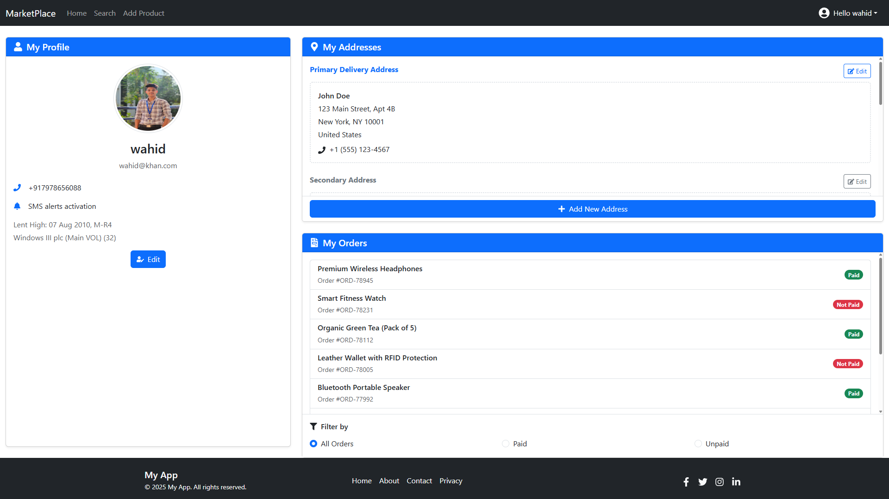

# MarketPlace 🛒  

A simple general store application to - create,read,update,delete products .

  
  
  
  
  

## Features ✨  

- 🚀 Create products quickly  
- 🔗 Search products  
- 📈 View products details  
- 🔒 Update,delete products
- 🔑 Key – For authentication or passwords (Login , signup)  
- 📱 Mobile-responsive design  

## Screenshots 📸  

### Home 
 
### Profile 
  
### Update Product 
  
### Signup 
  

## Installation 🛠️  

1. Clone the repository:  
  ```bash  
 git clone https://github.com/yourusername/MarketPlace(CRUD fullStack).git  
 cd MarketPlace(CRUD fullStack)
 ```
2.Install dependencies for both client and server:
  ```bash
cd frontend && npm install
npm run dev
cd backened && npm install
npm run server
```
3.Set up environment variables:
 Create a .env file in the server directory with:
  ```bash
MONGO_URI=your_mongodb_connection_string  
PORT=5000  
JWT_SECRET=your_jwt_secret  
```
## 💻 *Tech Stack Used in This MarketPlace*

  | Area             |    Technology                           |
  | ---------------- | --------------------------------------- |
  | Frontend         | React 19,  Chart.js,Tailwind CSS  |
  | Backened         | Node.js, Express                        |
  | Database         | Mongodb                                 |
  | Authentication   | JWT                                     |


<br>

## License 📄

This project is licensed under the MIT License - see the LICENSE file for details.
<br>

## Contact 📧

For questions or feedback, reach out to:

Email: iwahidkhan786@gmail.com

Linked: [*Md Wahid*](https://www.linkedin.com/in/md-wahid-797300326)

.
